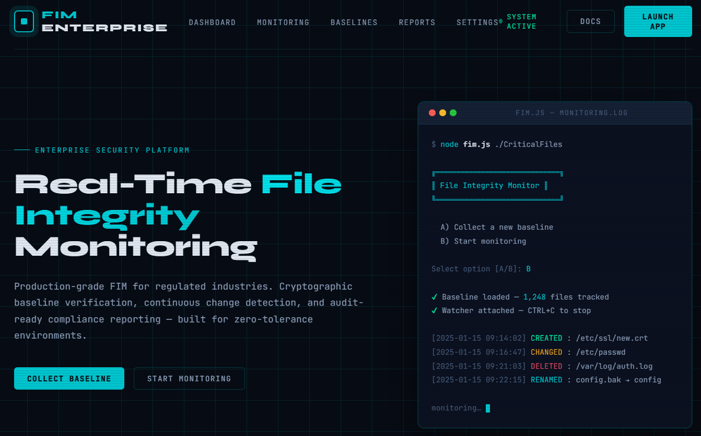
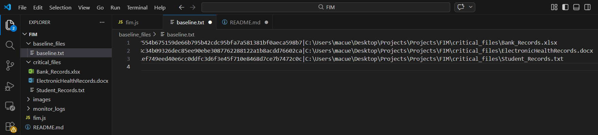
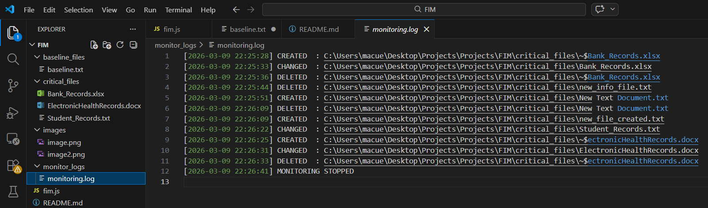

# File Integrity Monitor (FIM)

A lightweight **File Integrity Monitoring** tool written in **Node.js** with **zero external dependencies**.

It scans a target directory, generates a baseline of file SHA-256 hashes, and then watches for changes to detect file modifications, creations, and deletions.
---



## ✅ Features

- **Baseline generation**: Scan a directory and record SHA-256 hashes for each file.
- **Real-time monitoring**: Watch for file modifications, creations, and deletions.
- **Minimal dependencies**: Uses only Node.js built-in modules (`fs`, `path`, `crypto`, etc.).
- **Audit logging**: Appends change events to `monitor_logs/monitoring.log`.
- **Cross-platform**: Works on Windows, macOS, and Linux.
---

## 🧰 Prerequisites

- **Node.js** (v14+ recommended)

---

## 🚀 Getting Started

1. Open a terminal in the project folder.
2. Run:

```sh
node fim.js [pathToMonitor]
```

If you omit `pathToMonitor`, the script defaults to the included `critical_files` directory.

### Options

When the script runs, you will be prompted to select an option:

- **A) Collect a new baseline**
  - Scans the target directory and writes `baseline_files/baseline.txt`.

- **B) Start monitoring using saved baseline**
  - Watches the directory for changes and logs events to `monitor_logs/monitoring.log`.

---

## 📁 Project Structure

- `fim.js` - Main script.
- `baseline_files/baseline.txt` - Baseline file hash list (generated by option A).
- `critical_files/` - Example directory containing files to monitor.
- `monitor_logs/monitoring.log` - Change event log.

---

## 📝 Notes

- If you run monitoring before generating a baseline, the script will prompt you to first collect a baseline.
- The baseline file uses the format: `SHA256_HASH|ABSOLUTE_PATH` per line.

---

## ✅ Example Workflow

1. Generate a baseline:

   ```sh
   node fim.js critical_files
   ```

   Choose **A** to collect the baseline.

   

2. Start monitoring:

   ```sh
   node fim.js critical_files
   ```

   Choose **B** to start monitoring using the saved baseline.

   

---

## The Top 10 Lessons Learned from the FIM Project:

1.	The File Integrity Monitoring (FIM) solution supports multiple business domains in meeting industry specific regulatory requirements, including HIPAA/HITECH, PCI DSS, FERPA, and SOC 2 Type II.
2.	The protection of log files is essential; maintaining immutability and tamper resistant cryptographic properties is critical to preventing unauthorized modification.
3.	A deliberate balance between security and system performance must be maintained, ensuring that only high priority events are captured and escalated through alerts or notifications.
4.	Modern, secure cryptographic hashing algorithms such as SHA 256 are strongly preferred over weak and deprecated algorithms like MD5 and SHA 1.
5.	Real time monitoring of critical security events plays a vital role in effective security operations and incident response.
6.	The project provided an in depth exploration of hashing algorithm principles—including determinism, the avalanche effect, collision resistance, and one way functions—and clarified their distinctions from encryption. Practical implementations included hashing passwords with added salt and pepper.
7.	The FIM application was developed using both Python and JavaScript, demonstrating cross language implementation capabilities.
8.	Since every computational action incurs cost, whether collecting, storing, transmitting, or processing data, detection and logging rules were optimized accordingly. Only essential digital assets were monitored, and administrators were alerted to critical events.
9.	APIs and software libraries proved valuable for improving code efficiency and optimizing development workflows.
10.	The current command line–based program has the potential to be expanded into a full stack application and deployed on cloud platforms such as AWS or Render.


---

## 📜 License

This project is part of my ongoing effort to build my SOC Analyst skill set.
